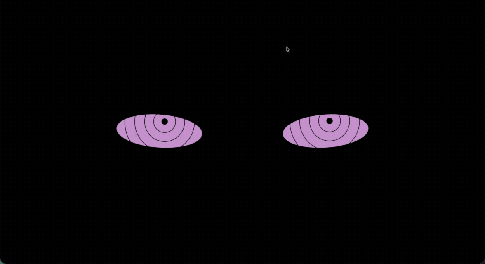

# Rinnegan Eyes Exercise

An interactive eye-tracking project inspired by the Rinnegan from Naruto.

### Live Demo

https://nicortiz1231.github.io/Rinnegan-Eyes-Exercise/

## Showcase



## About the Project

This project was created as part of the MIT xPRO Full Stack Development program and later revisited as part of my portfolio.

The original exercise focused on creating eyes that follow the user's mouse movement across the screen.

I customized the project with a Rinnegan-inspired design featuring its recognizable concentric-ring appearance while working with JavaScript event handling, browser coordinates, DOM manipulation, and CSS positioning.

## Features

- Eyes follow the mouse cursor in real time
- Rinnegan-inspired concentric-ring design
- Dynamic positioning based on cursor coordinates
- Interactive browser-based animation
- Lightweight static web application

## Technologies Used

- HTML
- CSS
- JavaScript

## What I Learned

This project helped me practice:

- DOM manipulation
- Mouse event handling
- Working with browser coordinates
- Updating element positions dynamically
- Connecting JavaScript behavior to visual elements
- CSS positioning and styling
- Debugging interactive browser behavior

Revisiting the project also gave me a chance to organize it as a standalone portfolio project and deploy it publicly with GitHub Pages.

## Running the Project Locally

Clone the repository:

```bash
git clone https://github.com/nicortiz1231/Rinnegan-Eyes-Exercise.git
```

Move into the project directory:

```bash
cd Rinnegan-Eyes-Exercise
```

Start a local server:

```bash
python3 -m http.server 8000
```

Then open:

```text
http://localhost:8000
```

## Deployment

This project is deployed using GitHub Pages.

Live version:

https://nicortiz1231.github.io/Rinnegan-Eyes-Exercise/
